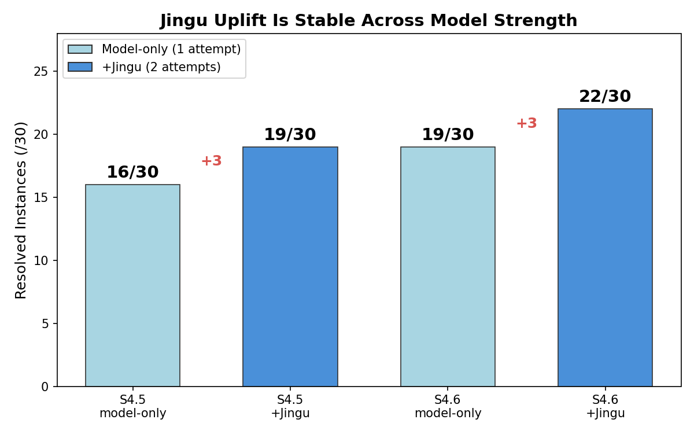
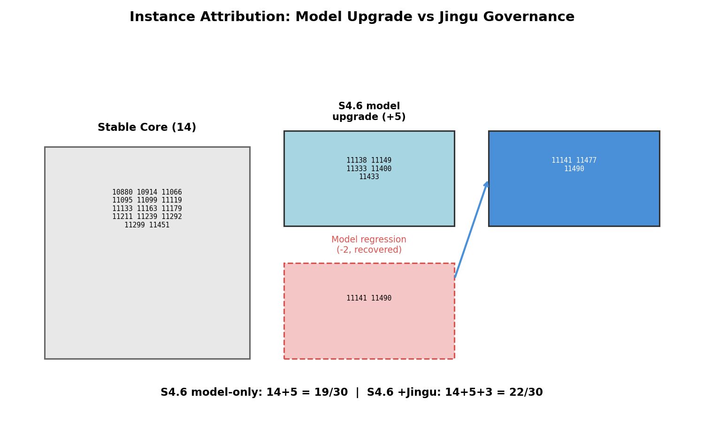

# jingu-swebench

SWE-bench harness for Jingu — runs LLM agents with governance gates on SWE-bench Verified instances, evaluates via official harness, tracks results over time.

## Results

**Jingu provides a stable +3 uplift across model tiers and pushes Opus 4.6 to 23/30 on SWE-bench Verified.**

| | Model-only (1 att) | +Jingu (2 att) | Jingu Δ |
|---|---|---|---|
| **Sonnet 4.5** | 16/30 (53.3%) | 19/30 (63.3%) | **+3** |
| **Sonnet 4.6** | 19/30 (63.3%) | 22/30 (73.3%) | **+3** |
| **Opus 4.6** | — | 23/30 (76.7%) | ceiling |




See [BENCHMARK_RESULTS.md](BENCHMARK_RESULTS.md) for full methodology, instance-level attribution, and reproducibility details.

Config: `configs/best_config_v1.yaml` — all reported numbers use this configuration.

### Demo: Jingu Retry in Action

A real SWE-bench instance where Attempt 1 fails, Jingu detects the failure and routes retry, and Attempt 2 succeeds:

```bash
python scripts/demo_jingu_retry.py
```

```
[STEP 1] Attempt 1 — INCOMPLETE FIX
  Agent patches URLResolver.reverse() → f2p = 1/3 passed
  Verdict: NOT RESOLVED

[STEP 2] Jingu Failure Analysis + Routing
  Failure type: incomplete_fix
  Routing: → DESIGN phase
  Execution feedback injected: failing test names + output

[STEP 3] Attempt 2 — RESOLVED
  Agent patches RegexPattern.match() → f2p = 3/3 passed
  Verdict: RESOLVED
```

### Reproduce in 3 Commands

```bash
./scripts/reproduce_benchmark.sh --model sonnet-4-6 --attempts 2   # → 22/30
./scripts/reproduce_benchmark.sh --model sonnet-4-6 --attempts 1   # → 19/30 (model-only)
./scripts/reproduce_benchmark.sh --model opus-4-6   --attempts 2   # → 23/30 (ceiling)
```

## Quick Start

All operations go through `ops.py`:

```bash
# Build + push Docker image (after code changes)
python scripts/ops.py build

# Full pipeline: smoke test → batch run → eval → store results
python scripts/ops.py pipeline --batch-name batch-p26 --runbook-ack

# Monitor a running batch
python scripts/ops.py watch --batch-name batch-p26

# View historical results
python scripts/ops.py history
python scripts/ops.py summary
```

## Architecture

### Runtime Stack

```
ECS (c5.9xlarge) → Docker container (privileged, DinD)
  └─ docker-entrypoint.sh
       ├─ --eval mode → swebench.harness.run_evaluation
       └─ default    → run_with_jingu_gate.py
                         └─ JinguAgent (extends mini-swe-agent ProgressTrackingAgent)
                              └─ per-step: visibility events, checkpoints, gate verdicts
```

### Agent Class Hierarchy

```
mini-swe-agent DefaultAgent
  └─ ProgressTrackingAgent (step hooks)
       └─ JinguProgressTrackingAgent (jingu step monitoring)
            └─ JinguDefaultAgent (Docker container lifecycle)
                 └─ JinguAgent (phase control, gate integration)
```

### Retry Loop

```
for attempt in 1..max_attempts:
    JinguAgent.run(instance)         # LLM agent with governance gates
    gate_result = evaluate_patch()   # structural patch evaluation
    if accepted: break
    hint = retry_controller(failure_class, exec_feedback)
    # inject hint for next attempt
best_patch → predictions.jsonl → S3
```

### Visibility System (p228-p230)

Each attempt produces:
- `attempt_N/step_events.jsonl` — per-step structured events (phase, gate verdict, files read/written)
- `attempt_N/prompt_snapshot.json` — complete prompt sent to LLM at attempt start
- `attempt_N/decisions.jsonl` — every gate verdict, retry decision, phase advance

### Checkpoint + Replay System (p231-p235)

- `attempt_N/checkpoints/step_N.json.gz` — full conversation state at phase transitions
- `replay_engine.py` — resume from any checkpoint with modified prompts
- `traj_diff.py` — compare two trajectories, find first divergence point
- `prompt_regression.py` — A/B replay + golden trajectory regression testing

## ops.py Commands

### Launch (only via pipeline)

| Command | Purpose |
|---------|---------|
| `build` | Build Docker image on EC2 via SSM, push to ECR |
| `pipeline` | **Only launch path**: smoke → batch → eval → store results |
| `pipeline --eval-only` | Eval existing S3 predictions (skip smoke + batch) |
| `pipeline --skip-smoke` | Skip smoke test, go straight to batch + eval |

### Monitor

| Command | Purpose |
|---------|---------|
| `peek` | Auto-polling CloudWatch signal logs (every 30s until STOPPED) |
| `watch` | Real-time log tail for batch or single instance |
| `logs` | CloudWatch log tail (raw) |
| `status` | ECS task status |
| `list-tasks` | Show running/pending ECS tasks |
| `smoke --task-id ID` | Attach to existing task (tail only, no launch) |

### Results

| Command | Purpose |
|---------|---------|
| `history` | Pipeline run history (resolved rates over time) |
| `summary` | Per-instance summary table grouped by repo |
| `backfill` | Populate per-instance records from historical batches |
| `discover` | Scan S3 for all predictions and eval status |
| `eval-all` | Discover + eval all unevaluated batches |

### Blocked (use `pipeline` instead)

`run`, `smoke` (launch mode), `eval` — these skip eval or don't track history. Blocked at entry.

## Pipeline Flow

```
ops.py pipeline --batch-name NAME
  │
  ├─ Step 1: Smoke test (1 instance, verify new behavior)
  │    └─ Check for ACCEPTED signal in logs
  │
  ├─ Step 2: Batch run (30 default django instances)
  │    └─ ECS task → run_with_jingu_gate.py → predictions.jsonl → S3
  │
  ├─ Step 3: Eval (SWE-bench official harness)
  │    └─ ECS task → swebench.harness.run_evaluation → eval_results.json → S3
  │
  └─ Step 4: Store results
       ├─ pipeline-results/history.json (batch-level)
       └─ pipeline-results/instances/<id>.json (per-instance)
```

## Output Structure

```
<batch_name>/
  jingu-predictions.jsonl          # predictions for SWE-bench eval
  run_report.json                  # execution identity, model usage, cost
  <instance_id>/
    traj.json                      # full agent trajectory
    patch.diff                     # accepted patch
    attempt_1/
      step_events.jsonl            # per-step structured events
      prompt_snapshot.json         # prompt sent to LLM
      decisions.jsonl              # gate verdicts, phase advances
      checkpoints/
        step_5.json.gz             # checkpoint at phase transitions
    attempt_2/
      ...
eval-<batch_name>/
  eval_results.json                # resolved_ids, unresolved_ids
```

## Infrastructure

- **ECR**: `235494812052.dkr.ecr.us-west-2.amazonaws.com/jingu-swebench:latest`
- **ECS Cluster**: `jingu-swebench` (EC2 launch type, c5.9xlarge)
- **S3**: `jingu-swebench-results` (all results + pipeline history)
- **CloudWatch**: `/ecs/jingu-swebench` (container logs)
- **ASG**: `jingu-swebench-ecs-asg` (scale 0↔1 for cost control)
- **Dataset**: SWE-bench Verified (500 instances, 231 django)

## Replay (offline, from checkpoints)

```bash
# List checkpoints for an instance
python scripts/replay_cli.py list-checkpoints --traj-dir results/<instance_id>

# Replay from step 5 with a hint
python scripts/replay_cli.py replay --traj-dir results/<instance_id> \
  --from-step 5 --inject-hint "Focus on the QuerySet.union() method"

# Compare original vs replayed trajectory
python scripts/replay_cli.py compare --original orig.traj.json --replayed replay.traj.json

# A/B prompt regression test
python scripts/prompt_regression.py ab --checkpoint path/to/step_5.json.gz \
  --variant-b "v2-explicit-scope" --inject-hint-b "Be more explicit about scope"
```

## Build and Deploy

See [docs/build-and-deploy.md](docs/build-and-deploy.md) and `.claude/smoke-test-runbook.md`.
